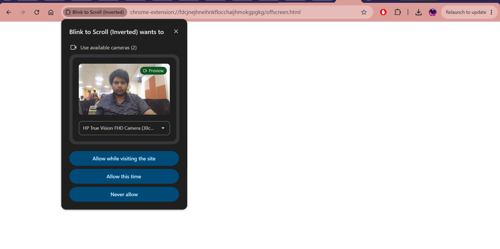
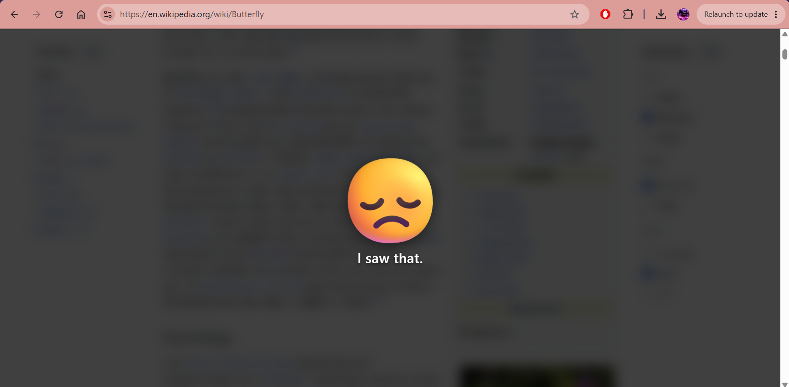
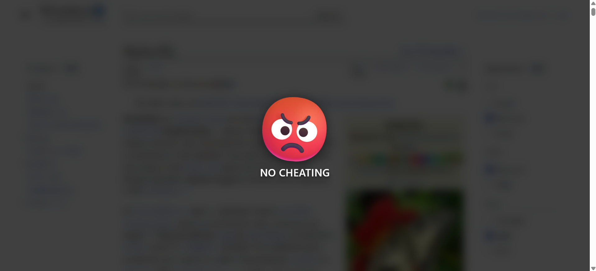
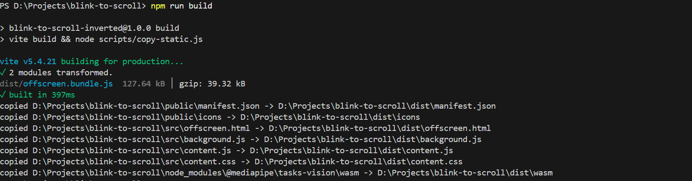
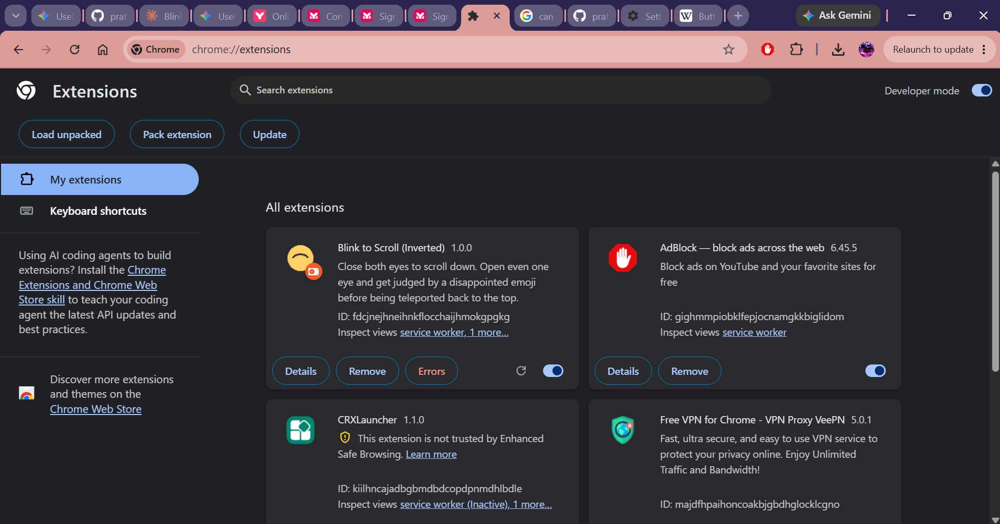
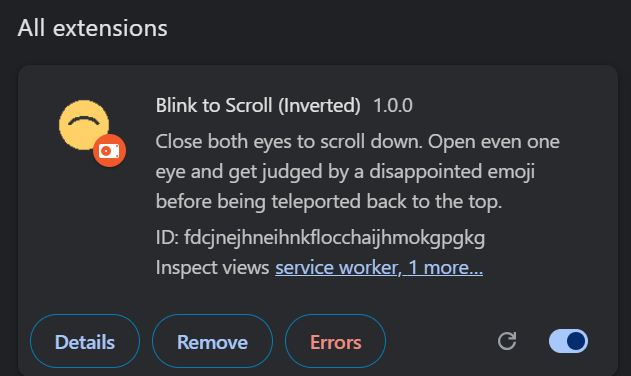

# Blink to Scroll (Inverted) 🎯

## Basic Details

### Team Name: Orion

### Team Members

- Team Lead: Pratyush - Cochin University College of Engineering Kuttanad
- Member 2: Rishik Kumar - Cochin University College of Engineering Kuttanad

### Project Description
Blink to Scroll is a Chrome/Chromium extension that uses a webcam and MediaPipe
face tracking to control webpage scrolling with eye gestures. Closing both
eyes scrolls down, while opening the eyes triggers a reset animation.

### The Problem (that doesn't exist)
People are forced to use their hands to scroll through webpages, even when
those hands are perfectly available for more important things.

### The Solution (that nobody asked for)
Blink to Scroll turns looking away from normal interaction into a control
system. Close both eyes to scroll, open them to face consequences, and raise a
hand to trigger the anti-cheating response.

## Technical Details

### Technologies/Components Used
For Software:

- JavaScript
- Chrome Extension Manifest V3
- Vite
- MediaPipe Tasks Vision
- Chrome Offscreen Documents API
- Chrome Storage and Alarms APIs
- Web APIs: `getUserMedia`, DOM, timers, and scrolling
- Chrome or another Chromium-based browser
- Node.js and npm

For Hardware:

- Webcam
- Computer capable of running a Chromium-based browser

### Implementation
For Software:

- `src/offscreen.js` captures webcam frames and detects faces, eye states, and hands.
- `src/background.js` manages the service worker, offscreen document, tab state, and message routing.
- `src/content.js` controls scrolling, progress display, and feedback overlays in the active page.
- `src/content.css` styles the progress bar, overlays, emoji animations, and hand animation.
- `scripts/copy-static.js` assembles the generated `dist/` folder with the manifest, static files, models, and MediaPipe WebAssembly runtime.

# Installation
Run these commands from the repository folder containing `package.json`.

### macOS, Linux, Git Bash, or WSL

```bash
npm install
mkdir -p public/models
curl -L --fail -o public/models/face_landmarker.task \
  https://storage.googleapis.com/mediapipe-models/face_landmarker/face_landmarker/float16/1/face_landmarker.task
curl -L --fail -o public/models/gesture_recognizer.task \
  https://storage.googleapis.com/mediapipe-models/gesture_recognizer/gesture_recognizer/float16/1/gesture_recognizer.task
npm run build
```

### Windows PowerShell 5.1 or 7

```powershell
npm install
New-Item -ItemType Directory -Force -Path public\models | Out-Null
Invoke-WebRequest -Uri "https://storage.googleapis.com/mediapipe-models/face_landmarker/face_landmarker/float16/1/face_landmarker.task" -OutFile "public\models\face_landmarker.task"
Invoke-WebRequest -Uri "https://storage.googleapis.com/mediapipe-models/gesture_recognizer/gesture_recognizer/float16/1/gesture_recognizer.task" -OutFile "public\models\gesture_recognizer.task"
npm run build
```

### Windows Command Prompt (`cmd.exe`)

```bat
npm install
if not exist public\models mkdir public\models
curl.exe -L --fail -o public\models\face_landmarker.task https://storage.googleapis.com/mediapipe-models/face_landmarker/face_landmarker/float16/1/face_landmarker.task
curl.exe -L --fail -o public\models\gesture_recognizer.task https://storage.googleapis.com/mediapipe-models/gesture_recognizer/gesture_recognizer/float16/1/gesture_recognizer.task
npm run build
```

Node.js 18 or newer is recommended. If Node.js is older than 18, install a
current LTS version from <https://nodejs.org/> or use a version manager.

# Run
1. Open `chrome://extensions` in Chrome or another Chromium browser.
2. Enable **Developer mode**.
3. Click **Load unpacked**.
4. Select the generated `dist/` folder.
5. Open a normal `http` or `https` website and click the extension icon.
6. Allow camera access when prompted.
7. Close both eyes to scroll. Open the eyes to stop and show the normal penalty animation.

After source changes, run `npm run build`, click **Reload** on the extension card,
and refresh the test page.

### Project Documentation
For Software:

- [Source code](src/)
- [Manifest](public/manifest.json)
- [Build script](scripts/copy-static.js)
- [Generated extension](dist/)

# Screenshots (Add at least 3)


The extension requests permission to access the webcam.



The extension responds when the user opens their eyes while scrolling.



The extension detects a raised hand and stops scrolling while the user's eyes are closed.

# Diagrams


The webcam continuously sends video frames to the hidden `offscreen.html` document,
which uses MediaPipe to determine whether the user's eyes are open or closed.
When both eyes are closed, the extension scrolls the webpage. When the eyes open,
scrolling stops, an animation plays, and the page scrolls back to the top.


# Build Photos



The project is built with npm into a format that can be loaded by the browser.



The built extension is loaded into Chrome for testing.



The completed extension controls webpage scrolling using eye and hand gestures.

### Project Demo

# Video

(https://drive.google.com/file/d/1KVp16zddrT71qVSppvnxfKViWkQZMq59/view?usp=drive_link)

This video demonstrates the extension in operation. The first two cases show
the user's eyes opening and closing. The third case shows a hand being raised
before the eyes are closed, which does not trigger scrolling. The final case
shows a hand being raised while the eyes are closed.

(https://drive.google.com/file/d/1jzw9zoVMO5LbY5dQyUK1sA3Bb7x-rQMI/view?usp=drive_link)

This video repeats the same demonstrations with the browser console output visible.

## Team Contributions

- Pratyush: MAde the basic program and proofread the README.md
- Rishik Kumar: Debugging and idea brainstorming
